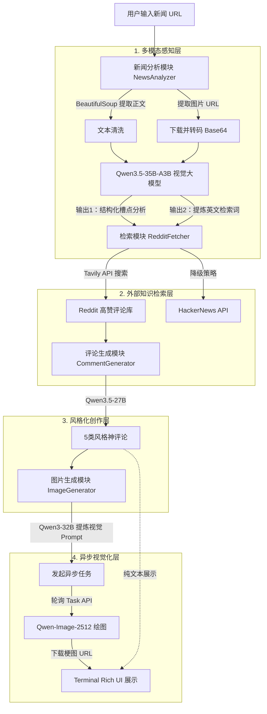

# NewsRoast-Agent (新闻神评论智能体)

这是一个全自动化的多模态新闻“神评论”生成 Agent 系统。它不仅能阅读新闻文本，还能“看懂”新闻配图中的潜台词。通过实时检索 Reddit 社区的真实网民反应，Agent 能够精准学习当代互联网的“网感”，最终为你生成 5 种不同社交风格的爆款神评论，并自动配上一张极具讽刺意味的 AI 梗图。

## ✨ 核心能力 (Core Features)

- 👁️ **多模态深度理解**：同步解析网页的正文与主图，识别图片与文字交织产生的“反差感”与“槽点”。
- 🧠 **互联网语境学习 (RAG)**：自动提炼搜索词，实时抓取 Reddit / HackerNews 上的高赞评论作为创作参考，拒绝“AI味”说教。
- ✍️ **多重人格文案生成**：一次性产出「引战、一针见血、抖机灵、发人深省、情感共鸣」5大风格的神评论。
- 🎨 **异步视觉造梗**：自动挑选最佳评论，逆向推导画面分镜（Prompt），并调用云端绘图模型生成 4K 级梗图。

---

## 1. 架构设计与数据流转 (Architecture)

系统采用了高度解耦的模块化设计，分为**感知、检索、创作、视觉化**四大核心层级。

### 系统流程图


---

## 2. 技术栈与选型理由 (Tech Stack)

为了保证效果与系统稳定性，本系统针对不同环节配置了最适合的 AI 模型：

| 模块               | 技术实现                    | 选型理由                                                     |
| :----------------- | :-------------------------- | :----------------------------------------------------------- |
| **多模态理解**     | **Qwen3.5-35B-A3B**         | 具备顶尖的 Vision 视觉理解力，能识别新闻配图中的人物神情与隐喻，实现“图文互证”的深度拆解。 |
| **外部知识检索**   | **Tavily API** / HN API     | Reddit 官方 API 限制严格。Tavily 专为 Agent 设计，可通过 `site:reddit.com` 精准穿透搜索，实时抓取网民反应。 |
| **神评论生成**     | **MiniMax/MiniMax-M2.5**    | 逻辑推理与角色扮演能力极强，能精准控制“毒舌”、“抖机灵”等文风，确保生成的评论“网感十足”。 |
| **图片提示词提炼** | **Qwen3-32B**               | 负责将抽象的中文段子转化为极具画面感、包含摄影术语的纯英文 Prompt。 |
| **图像生成**       | **Qwen-Image-2512 (Async)** | 顶尖中文生态生图大模型。采用**异步轮询机制**，彻底解决大图生成时的网络超时阻塞问题。 |
| **前端交互**       | **Rich (Python)**           | 提供了极佳的终端美化效果，支持 Markdown 原生渲染与高亮，提升开发者体验。 |

---

## 3. 工作流详述 (Workflow)

当用户在终端输入一条新闻 URL 后，Agent 开始执行以下步骤：

1. **阅读与转换 (Reading & Encoding)**：
   - 使用 `BeautifulSoup` 提取网页正文 `<p>` 标签与主图 `` 链接。
   - **自动下载图片并转换为 Base64 编码**，与文本组合构建多模态 Prompt。
2. **槽点扫描 (Vulnerability Scanning)**：
   - 视觉模型分析人物表情与文字反差，提取事件核心、槽点、争议点。
   - 强制模型输出专门用于外网搜索的降维关键词（如 `SEARCH_QUERY: Apple Tariff Cook Trump`）。
3. **灵感剽窃 (Inspiration Retrieval)**：
   - 拿着搜索词通过 Tavily 深入 Reddit 对应帖子，抓取真实人类的点赞最高评论，作为 Few-shot 示例加载到上下文中。
4. **多重影分身创作 (Creative Generation)**：
   - 结合新闻背景与 Reddit 灵感，模型化身段子手，输出 5 条截然不同风格的神评论。
5. **视觉转化 (Visual Translation)**：
   - 另一位 AI 挑选最佳评论，逆向设计出具备讽刺意味的画面提示词（如 *satirical digital art, cinematic lighting*）。
   - 向云端发送生图指令，并通过持续轮询，直到 4K 梗图生成完毕，向用户返回链接。

---

## 4. 核心工程挑战与对策 (Challenges & Solutions)

本项目在开发中解决了以下 3 个核心工程难题：

### 🚨 挑战一：模型服务端无法拉取公网图片 URL
- **痛点**：最初直接将新闻图片 URL 传给大模型，但由于防盗链或内网隔离，模型服务器频繁报 403 无法拉取图片，导致视觉功能失效。
- **对策**：在 `NewsAnalyzer` 中实现了本地代理机制。先由 Python 后端用 `requests` 下载图片，在内存中动态推断图片类型并**转码为 Base64 格式**，将二进制数据直接塞进 Prompt（`data:image/jpeg;base64,...`）。彻底消灭了网络图片解析失败率。

### 🚨 挑战二：Reddit API 对新开发者的严格封锁
- **痛点**：Reddit 近期收紧了 API 政策，新注册应用极难获取权限，直接导致 RAG（检索增强）模块瘫痪。
- **对策**：引入专为 LLM 打造的搜索引擎 **Tavily API**。在检索时强制附加 `site:reddit.com comments` 约束参数，在不依赖官方 API 的情况下，依然完美抓取到了 Reddit 里的原生高赞评论。并增加了 HackerNews 的 Algolia API 作为降级兜底方案。

### 🚨 挑战三：高质量图像生成的 HTTP 超时崩溃
- **痛点**：生成复杂的 4K 梗图往往需要 10~30 秒，常规的 HTTP 同步请求极易引发 `ReadTimeout`，导致整个 Agent 崩溃停机。
- **对策**：在 `ImageGenerator` 中启用了 ModelScope 的**异步任务队列 (Async Mode)**。Agent 发出任务获取 `task_id` 后立即释放连接，转入心跳轮询模式（每 5 秒查询一次状态），大幅提升了系统的工业级鲁棒性。

---

## 5. 快速开始 (Quick Start)

### 5.1 环境安装

```bash
# 克隆项目后，安装依赖
pip install -r requirements.txt
```

### 5.2 配置密钥

在项目根目录创建 `.env` 文件，填入你的 API Key：

```env
# 魔塔社区 API KEY (提供全部 Qwen 模型支持)
MODELSCOPE_API_KEY=your_dashscope_api_key_here

# Tavily API KEY (用于突破 Reddit 搜索限制)
TAVILY_API_KEY=your_tavily_api_key_here
```

### 5.3 运行 Agent

```bash
python main.py
```
*(运行后，你可以粘贴任意新闻链接，或直接按回车使用默认的「苹果投资新闻」进行测试)*

---

## 📂 项目结构

```text
📦 NewsRoast-Agent
 ┣ 📂 modules
 ┃ ┣ 📜 news_analyzer.py      # 图文双修的新闻解析模块
 ┃ ┣ 📜 reddit_fetcher.py     # 基于 Tavily 的外网神评论检索模块
 ┃ ┣ 📜 comment_generator.py  # 5重人格段子手文案生成模块
 ┃ ┗ 📜 image_generator.py    # 异步轮询的 AI 梗图绘制模块
 ┣ 📜 main.py                 # Agent 核心总控台 & UI
 ┣ 📜 config.py               # 模型参数与 Prompt 统一配置中心
 ┣ 📜 requirements.txt        # 依赖清单
 ┗ 📜 .env                    # 密钥配置 (需用户自行创建)
```
