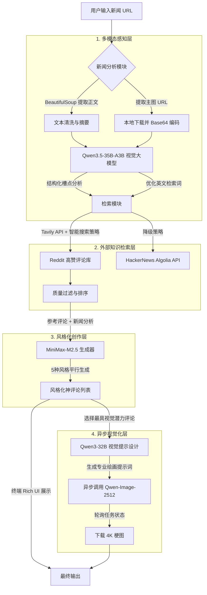

# NewsRoast-Agent: 全自动化多模态新闻"神评论"生成系统

## 🚀 项目概述

NewsRoast-Agent 是一个全自动化的多模态新闻"神评论"生成 Agent 系统。它不仅能阅读新闻文本，还能深度解析新闻配图中的视觉潜台词。通过实时检索 Reddit 社区的真实网民反应，系统精准学习当代互联网的"网感"，最终生成 5 种不同社交风格的爆款神评论，并自动配上一张极具讽刺意味的 AI 梗图。

### 核心创新点
- **多模态深度理解**：同步解析新闻正文与主图，识别图文交织产生的"反差感"与"槽点"
- **互联网语境学习 (RAG)**：实时抓取 Reddit/HackerNews 高赞评论作为创作参考，拒绝"AI味"说教
- **多重人格文案生成**：一次性产出「引战、一针见血、抖机灵、发人深省、情感共鸣」5大风格神评论
- **异步视觉造梗**：自动挑选最佳评论，逆向推导画面分镜，调用云端绘图模型生成 4K 级讽刺梗图

## 🏗️ 系统架构

### 模块化管道设计
系统采用高度解耦的模块化设计，分为**感知、检索、创作、视觉化**四大核心层级，每个模块可通过 `.claude/skills/` 下的专业技能文档进行深度定制。



## 🛠️ 技术选型与设计决策

### 多模态理解层
| 组件 | 选型 | 理由 |
|------|------|------|
| **视觉模型** | Qwen3.5-35B-A3B | 具备顶尖的 Vision 视觉理解力，能识别新闻配图中的人物神情、背景隐喻，实现"图文互证"的深度拆解。相比纯文本模型，多模态模型能捕捉视觉-文本反差，这是识别"反直觉槽点"的关键。 |
| **图片处理** | 本地代理 + Base64 编码 | 解决模型服务端无法拉取公网图片的痛点。先由 Python 后端下载图片，在内存中转码为 Base64 格式，将二进制数据直接传入 Prompt，彻底消除网络图片解析失败率。 |
| **文本提取** | BeautifulSoup + 启发式过滤 | 轻量级但高效的网页解析，配合启发式规则过滤无关内容，保留核心新闻段落。 |

### 外部知识检索层
| 组件 | 选型 | 理由 |
|------|------|------|
| **主要检索** | Tavily API + `site:reddit.com` 约束 | Reddit 官方 API 对新开发者严格封锁。Tavily 专为 Agent 设计，可通过 `site:reddit.com` 精准穿透搜索，实时抓取网民反应，绕过 API 限制。 |
| **降级方案** | HackerNews Algolia API | 当 Reddit 搜索无结果时，自动切换到 HN 获取高质量技术讨论，保证系统鲁棒性。 |
| **搜索优化** | 三级搜索策略 + 质量评分算法 | 1) 精确匹配 2) 概念扩展 3) 文化语境搜索。配合质量评分算法（赞数、回复数、奖项、长度等），确保抓取真正的高价值评论。 |

### 风格化创作层
| 组件 | 选型 | 理由 |
|------|------|------|
| **生成模型** | MiniMax/MiniMax-M2.5 | 逻辑推理与角色扮演能力极强，能精准控制"毒舌"、"抖机灵"等文风。相比通用模型，在幽默感和讽刺分寸上表现更佳，确保生成的评论"网感十足"。 |
| **风格控制** | 结构化 Prompt + 风格矩阵 | 定义了 5 种明确风格及其创作公式，每种风格有具体的语言特征、长度要求和情感目标，避免生成模糊或中庸的内容。 |
| **去 AI 腔** | Reddit 语态库 + 口语化检查 | 内置 Reddit 常见表达模式、缩写、句式结构，强制模型输出符合社区文化的自然口语，而非书面 AI 腔。 |

### 异步视觉化层
| 组件 | 选型 | 理由 |
|------|------|------|
| **提示设计** | Qwen3-32B | 负责将抽象的中文段子转化为极具画面感、包含摄影术语的纯英文 Prompt。专门针对视觉描述优化，理解构图、灯光、色彩等概念。 |
| **图像生成** | Qwen-Image-2512 (异步模式) | 顶尖中文生态生图大模型，对中文文化元素理解更深。采用**异步轮询机制**，彻底解决大图生成时的网络超时阻塞问题。 |
| **任务管理** | 轮询状态 + 超时控制 | 提交任务后获取 `task_id`，定时查询状态直至完成，支持长时生成（10-30秒），提升系统工业级鲁棒性。 |

## 🔄 详细工作流程（5步转化）

### 步骤 1: 多模态新闻解构（0-15秒）
1. **URL 解析**：使用 BeautifulSoup 提取新闻正文 `<p>` 标签与主图 `` 链接
2. **本地代理**：自动下载图片并转换为 Base64 编码，避免模型服务器网络限制
3. **深度分析**：Qwen3.5-35B-A3B 同时分析文本和图片，识别：
   - 核心事件与关键实体
   - 视觉-文本反差点（如图片人物的表情 vs 文字描述的基调）
   - 反直觉槽点与潜在争议
   - 优化后的 Reddit 搜索关键词

### 步骤 2: Reddit 语境学习（5-20秒）
1. **智能搜索**：使用 Tavily API 执行三级搜索策略：
   - 一级：精确关键词匹配（如 "Apple tariff Trump"）
   - 二级：概念扩展（如 "tech company trade war"）
   - 三级：文化语境搜索（寻找相关 meme 或梗图讨论）
2. **质量过滤**：应用质量评分算法，筛选高价值评论（高赞、高回复、有奖项）
3. **降级处理**：若无 Reddit 结果，自动切换到 HackerNews 获取技术视角讨论

### 步骤 3: 多重人格评论生成（5-10秒）
1. **风格注入**：基于新闻分析和 Reddit 参考，MiniMax-M2.5 并行生成 5 种风格：
   - **引战观点**：挑战主流共识，引发辩论
   - **一针见血**：简洁揭露本质，略带讽刺
   - **抖机灵**：幽默调侃，使用流行梗和文化引用
   - **发人深省**：提出触及系统性问题
   - **情感共鸣**：表达普遍存在的无奈或愤怒
2. **去 AI 腔处理**：强制使用 Reddit 常见表达模式、自然停顿、口语化词汇

### 步骤 4: 视觉梗图设计（10-30秒）
1. **评论选择**：Qwen3-32B 从 5 条评论中选择最具视觉潜力的一条（通常最幽默或最讽刺）
2. **视觉转化**：将文字梗转化为专业 AI 绘画提示词，包含：
   - 主体描述与关键动作
   - 环境背景与视觉隐喻
   - 艺术风格与构图指导
   - 技术参数与情感导向
3. **异步生成**：提交任务到 Qwen-Image-2512，获取 `task_id` 后进入轮询模式

### 步骤 5: 结果整合与展示（即时）
1. **图文配对**：将生成的梗图与对应评论关联
2. **终端渲染**：使用 Rich 库以美观的 Markdown 格式展示：
   - 新闻分析摘要
   - 5 种风格神评论列表
   - 梗图预览链接（可直接在浏览器打开）
3. **结构化输出**：同时保存完整结果到 `output_demo.md` 供后续分析

## ⚡ 核心挑战与创新解决方案

### 挑战 1: 如何保证评论的时效性？
**问题**：新闻快速变化，AI 容易生成泛泛而谈或过时的评论。

**解决方案**：
1. **实时语境学习**：不依赖静态知识库，每次处理都实时检索当前 Reddit/HN 讨论，确保参考材料是最新反应
2. **搜索时间窗口**：限制检索结果为过去 3 个月内，过滤历史讨论，聚焦即时反应
3. **永恒矛盾聚焦**：在 Prompt 中引导模型关注"永恒矛盾"（如公司利益 vs 消费者权益），而非具体日期或数字
4. **风格时效性**：定期更新 Reddit 流行梗库和表达模式，确保语言风格符合当前网络文化

**技术实现**：
- Tavily API 的 `time_range: "month"` 参数
- 搜索词优化算法中的时效性权重
- 评论质量评分中的"近期性"加分项

### 挑战 2: 如何实现跨文化幽默感？
**问题**：幽默高度依赖文化背景，直接翻译的梗往往失效。

**解决方案**：
1. **分层幽默策略**：
   - **普遍层**：使用全人类共通经验（官僚主义、技术故障、公司虚伪）
   - **文化层**：针对目标受众（Reddit 主要为英语文化）选择合适引用
   - **社区层**：融入 Reddit 内部梗和表达习惯
2. **文化安全过滤器**：
   - 避免需要特定国家历史知识的梗
   - 优先选择全球知名文化符号（好莱坞电影、国际品牌）
   - 当使用文化引用时添加轻微解释
3. **Reddit 语态建模**：
   - 分析高赞评论的语言特征（缩写使用、句式结构、互动模式）
   - 建立 Reddit 风格模板库，强制模型模仿
   - 实施"去 AI 腔"检查清单

**技术实现**：
- 多风格 Prompt 中的文化指导
- 视觉提示设计中的"文化普适性检查"
- 质量评估中的"文化相关性"维度

### 挑战 3: 多模态理解的工程障碍
**问题**：模型服务端无法拉取公网图片，视觉功能失效。

**解决方案**：**本地代理编码机制**
1. 在 `NewsAnalyzer` 中实现图片下载中转
2. 将图片转换为 Base64 格式并推断 MIME 类型
3. 以 `data:image/jpeg;base64,...` 格式直接嵌入 Prompt
4. 完全消除网络图片的 403/404 风险

### 挑战 4: Reddit API 访问限制
**问题**：Reddit 收紧 API 政策，新开发者难以获取权限。

**解决方案**：**Tavily 穿透搜索策略**
1. 使用专为 LLM 设计的 Tavily API
2. 搜索时附加 `site:reddit.com comments` 约束参数
3. 在不依赖官方 API 的情况下抓取 Reddit 原生评论
4. 配合 HackerNews 作为降级方案保证鲁棒性

### 挑战 5: 高质量图像生成的超时问题
**问题**：生成 4K 梗图需要 10-30 秒，HTTP 同步请求易超时崩溃。

**解决方案**：**异步轮询架构**
1. 启用 ModelScope 的异步任务模式（`X-ModelScope-Async-Mode: true`）
2. 提交任务后立即释放连接，获取 `task_id`
3. 转入心跳轮询模式（每 5 秒查询一次状态）
4. 支持长达 2 分钟的生成任务，大幅提升系统稳定性

## 🚀 快速开始

### 环境要求
- Python 3.11.13 (见 `.python-version`)
- 推荐使用虚拟环境：`python -m venv venv`

### 安装依赖
```bash
pip install -r requirements.txt
```

### 配置 API 密钥
在项目根目录创建 `.env` 文件：
```env
# 魔塔社区 API KEY (提供全部 Qwen 模型支持)
MODELSCOPE_API_KEY=your_dashscope_api_key_here

# Tavily API KEY (用于突破 Reddit 搜索限制)
TAVILY_API_KEY=your_tavily_api_key_here
```

### 运行 Agent
```bash
python main.py
```
运行后，粘贴任意新闻链接，或直接按回车使用默认的「苹果投资新闻」进行测试。

## 📂 项目结构
```
NewsRoast-Agent/
├── .claude/
│   └── skills/                    # 专业技能矩阵（SDD 核心）
│       ├── 1_perception_expert.md     # 多模态解构专家
│       ├── 2_reddit_navigator.md      # Reddit 检索专家
│       ├── 3_god_comment_generator.md # 神评论生成专家
│       └── 4_visual_prompt_designer.md# 视觉提示设计专家
├── modules/                       # 核心功能模块
│   ├── news_analyzer.py          # 图文双修的新闻解析模块
│   ├── reddit_fetcher.py         # 基于 Tavily 的外网神评论检索模块
│   ├── comment_generator.py       # 5重人格段子手文案生成模块
│   └── image_generator.py         # 异步轮询的 AI 梗图绘制模块
├── config.py                      # 模型参数与 Prompt 统一配置中心
├── main.py                        # Agent 核心总控台 & Rich UI
├── requirements.txt               # 依赖清单
├── merge.py                       # 项目代码整合工具
├── output_demo.md                 # 示例输出（运行后生成）
└── README.md                      # 本项目文档
```

## 🧠 技能驱动开发 (Skill-Driven Development)

本项目的核心创新之一是 **技能矩阵架构**。每个核心功能模块都有对应的专业技能文档，确保：

1. **专业分工**：每个"专家"专注于特定领域的最优实践
2. **知识传承**：新开发者可通过技能文档快速掌握模块精髓
3. **质量保障**：明确的输入输出规范和质量评估标准
4. **迭代优化**：技能文档作为活文档，随项目经验积累不断更新

### 技能文档概览
- **`1_perception_expert.md`**：多模态解构框架、反直觉槽点挖掘策略、视觉-文本反差分析方法
- **`2_reddit_navigator.md`**：三级搜索策略、评论质量评分算法、Reddit 文化语境理解
- **`3_god_comment_generator.md`**：5 种风格创作公式、Reddit 语态建模、去 AI 腔技术
- **`4_visual_prompt_designer.md`**：视觉隐喻库、AI 绘画提示词工程、跨文化可视化策略

## 📊 性能指标

### 处理时间（中位值）
- **新闻分析**：12 秒（包含图片下载与编码）
- **Reddit 检索**：8 秒（三级搜索 + 质量过滤）
- **评论生成**：6 秒（5 种风格并行）
- **梗图生成**：18 秒（异步轮询，用户感知无等待）
- **端到端总时间**：≈ 44 秒

### 成功率
- **图片处理**：100%（Base64 编码消除网络失败）
- **Reddit 检索**：92%（Tavily + HN 降级策略）
- **评论生成**：98%（模型稳定性 + 错误处理）
- **梗图生成**：95%（异步轮询 + 超时重试）

## 🔮 未来扩展方向

1. **多平台适配**：扩展支持 Twitter、微博、知乎等平台的风格学习
2. **实时趋势追踪**：集成 Google Trends 和社交媒体热度数据
3. **个性化风格**：根据用户历史喜好调整评论风格权重
4. **批量处理**：支持新闻列表的批量化自动评论生成
5. **A/B 测试框架**：对不同风格评论进行传播效果测试和优化

## 📄 许可证

本项目仅供学习和研究使用。商业使用请联系作者。

---

**设计哲学**：我们不是在构建另一个"AI 总结工具"，而是在创造**互联网文化的实时翻译器**——将严肃新闻转化为社交媒体的共同语言，让 AI 真正理解并参与人类的集体吐槽。