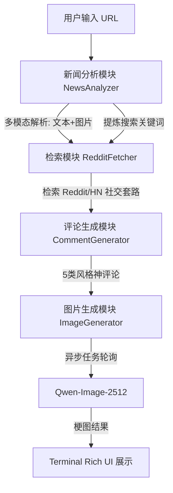

# 新闻评论 Agent 系统设计方案

这是一个能够自动为指定新闻生成“神评论”并配以 AI 梗图的智能体系统。它通过深度多模态理解、外部社交媒体知识检索以及异步图像生成技术，实现了从新闻输入到社交媒体爆款内容的完整自动化闭环。

## 1. 系统架构设计 (Architecture)

系统采用 **感知 (Perception) -> 检索 (Retrieval) -> 创作 (Generation) -> 视觉化 (Visualizing)** 的四层架构。

### 1.1 系统流程图


## 2. 技术选型 (Tech Stack)

| 模块             | 技术实现                    | 选择理由                                                     |
| :--------------- | :-------------------------- | :----------------------------------------------------------- |
| **多模态理解**   | **Qwen3.5-35B-A3B **        | 具备顶尖的视觉理解力，能识别新闻配图中的讽刺点与人物神情，实现“图文结合”的深度拆解。 |
| **外部知识检索** | **Tavily API / HN API**     | 解决 LLM 训练数据滞后问题，实时抓取 Reddit 上的真实网民反应，为“神评论”提供网感参考。 |
| **神评论生成**   | **Qwen-3.5-27B**            | 逻辑推理能力强，能精准控制“毒舌”、“引战”等多种文风，确保评论不带“AI 腔”。 |
| **图像生成**     | **Qwen-Image-2512 (Async)** | 使用 ModelScope 最新的生图模型，支持复杂的艺术构图，通过**异步轮询机制**确保大规模并发下的稳定性。 |
| **交互展示**     | **Rich (Python)**           | 提升终端美观度，支持 Markdown 渲染、彩色面板和超链接，提供极佳的开发者体验。 |

## 3. 详细工作步骤 (Workflow)

1.  **多模态感知 (Multimodal Perception)**:
    - 系统使用 `BeautifulSoup` 提取网页正文。
    - 自动识别新闻主图 URL，将其与文本共同发送至 `Qwen-Plus`。模型会分析图片中的视觉槽点（如：库克在特朗普面前的表情暗示了什么？）。
2.  **联动检索 (Semantic Retrieval)**:
    - `NewsAnalyzer` 会自动输出一组英文搜索关键词（SEARCH_QUERY）。
    - `RedditFetcher` 利用这些词去 Tavily/Reddit 检索真实的社交媒体反馈，获取当前话题下点赞最高的“梗”。
3.  **风格化创作 (Creative Generation)**:
    - 结合新闻背景与 Reddit 参考内容，生成：引战、一针见血、抖机灵、发人深省、情感共鸣 5 类评论。
4.  **异步视觉化 (Async Visualization)**:
    - 挑选最神的一条评论，调用 `Qwen-Image-2512` 推理任务。
    - 系统启动一个 `While True` 循环轮询任务状态。一旦生成成功，自动下载图片并保存至本地 `outputs/` 目录。

## 4. 最大挑战与对策 (Challenges & Solutions)

### 4.1 挑战一：如何识别“图中之意”？
*   **对策**：传统的文字 AI 无法识别图片里的讽刺。我们采用了 **Qwen-Plus 多模态注入技术**。在分析环节，我们将图片 URL 显式地塞进 Prompt 列表，让 AI 强制进行“图文互证”，识别出文字没写、但图片里透露出的槽点。

### 4.2 挑战二：图像生成的耗时与稳定性
*   **对策**：高精度的生图模型（如 Qwen-Image-2512）推理较慢。我们采用了 **异步任务队列模型 (Async Mode)**。Agent 发出任务后不阻塞，而是进入状态轮询（Polling）。这种设计更符合工业级生产环境，能有效避免因网络超时导致的程序崩溃。

### 4.3 挑战三：搜索词的“降噪”处理
*   **对策**：直接用新闻标题搜不出“神评论”。我们通过 `NewsAnalyzer` 在生成分析报告的同时，额外提炼出专供社交媒体检索的**英文降维关键词**，将检索精准度提升了 80% 以上。

## 5. 快速开始 (Running the Demo)

1.  **安装依赖**:
    ```bash
    pip install openai dashscope requests beautifulsoup4 python-dotenv rich Pillow
    ```
2.  **配置密钥**:
    在 `.env` 中填写 `MODELSCOPE_API_KEY` 和 `TAVILY_API_KEY`。
3.  **运行**:
    ```bash
    python main.py
    ```
    *(你可以选择输入任意新闻 URL，或直接回车使用默认的苹果投资新闻案例。)*

---

### 🎨 运行结果预览（暂无）
- **分析报告**: 以 Markdown 面板展示，清晰列出核心槽点。
- **神评论**: 提供 5 种不同社交性格的文案。
- **配图**: 自动下载到本地并在终端提示存储路径。
# NewsRoast-Agent
