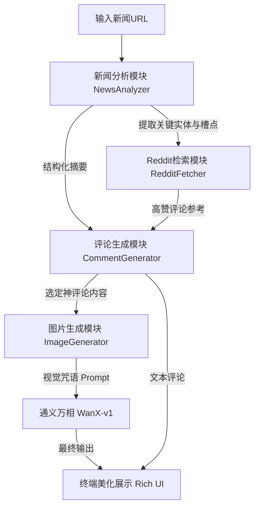

==================================================
FILE: README.md
==================================================

```md
# 📝 新闻评论 Agent 系统设计方案与实现

本项目实现了一个全自动化的新闻“神评论”生成智能体（Agent）。它能够深度解析新闻内容，学习 Reddit 社区的高赞互动模式，并原创出具有社交爆发力的图文评论。

## 1. 系统架构与流程图

系统采用模块化设计，确保了从信息输入到创意输出的线性流转与逻辑解耦。

### 1.1 流程图 (Mermaid)


### 1.2 项目结构
- `main.py`: Agent 指挥中心，控制任务流转。
- `config.py`: 动态配置中心，管理 Prompt 与模型参数。
- `modules/`:
    - `news_analyzer.py`: 负责内容解析与多维分析。
    - `reddit_fetcher.py`: 负责外部知识（Reddit）的检索与学习。
    - `comment_generator.py`: 负责创意文案的生成。
    - `image_generator.py`: 负责视觉意图理解与图片生成。

---

## 2. 技术栈说明

| 模块 | 核心技术 | 选择理由 |
| :--- | :--- | :--- |
| **帖子理解** | 通义千问 `qwen-plus` | 具备极强的中文理解力与逻辑推理能力，能精准识别讽刺与争议点。 |
| **检索学习** | `PRAW` (Python Reddit API) | Reddit 是全球神评论的策源地，通过 PRAW 可实时获取最符合社交直觉的互动模式。 |
| **内容抓取** | `BeautifulSoup4` + `Requests` | 轻量级、高效地提取网页主体内容，排除广告干扰。 |
| **评论生成** | 通义千问 `qwen-plus` | 相比其他模型，Qwen2.5 序列在中文语境下的“网感”更好，擅长不同风格的文案创作。 |
| **图文配图** | 通义万相 `WanX-v1` | 阿里云原生生图模型，对中文指令理解深入，且生成风格多样化。 |
| **终端展示** | `Rich` | 提供 Markdown 渲染与面板展示，提升开发者交互体验。 |

---

## 3. 详细工作步骤

1.  **深度解析 (Understanding)**:
    - Agent 接收 URL 后，抓取网页 `<p>` 标签内容。
    - 调用 `qwen-plus` 进行多维扫描：不仅总结事实，还专门挖掘“潜台词”、“争议点”和“可吐槽的细节”。
2.  **检索学习 (Learning)**:
    - 提取新闻中的核心实体（如 Apple, Trump）。
    - 自动前往 Reddit 搜索相关话题，抓取 Score（点赞数）排名前列的评论作为 Few-shot 示例，喂给生成模型学习其幽默逻辑。
3.  **创意生成 (Generating)**:
    - 结合新闻背景与学习到的套路，按照“引战、总结、玩笑、提问、共鸣”五种预设风格各生成一条评论。
4.  **视觉重构 (Visualizing)**:
    - Agent 自主阅读生成的 5 条评论，挑选出最具画面冲击力的一条。
    - 再次调用大模型，将“文字评论+新闻背景”转化为“视觉描述语（Prompt）”，最后由通义万相生成梗图 URL。

---

## 4. 挑战分析与对策

### 挑战 A：如何避免 AI 生成的评论“太像 AI”？
- **分析**：AI 往往喜欢讲大道理，缺乏人类那种“损”和“机灵”的感觉。
- **对策**：
    1.  **引入 RAG**：通过 Reddit 检索真实的人类高赞评论，让 AI 模仿其语气，而不是凭空想象。
    2.  **Prompt 工程**：在系统提示词中明确禁止“寒暄”和“正能量总结”，要求其追求“讽刺感”和“一针见血”。

### 挑战 B：图文匹配的“文不对题”问题
- **分析**：单纯根据评论画图，容易脱离新闻背景（如你之前遇到的生成“键盘侠”而非“苹果新闻”）。
- **对策**：
    1.  **上下文注入**：在生成图片 Prompt 时，强行将`新闻摘要`作为背景知识输入，确保画面中出现新闻相关的实体（如 Logo、人物）。
    2.  **二次转译**：增加一层“艺术总监”逻辑，让 AI 先思考“这张图该怎么表达这个梗”，生成 Prompt 后再画图。

### 挑战 C：网页抓取的局限性
- **分析**：现代网页有很多动态加载内容或反爬机制。
- **对策**：
    1.  **Header 伪装**：在代码中加入 User-Agent 伪装成浏览器。
    2.  **内容截断**：对抓取内容进行长度限制，防止超出模型 Context Window，同时保留最核心的新闻头部信息。

---

## 5. 运行结果展示

*(注：此处可粘贴你运行后的终端截图或文字输出)*

- **新闻源**: Apple $100 Billion Investment...
- **AI 提取槽点**: 库克用 1000 亿买“免死金牌”（关税豁免）。
- **生成评论示例**: "Cook: 'I'll give you a hundred billion.' Trump: 'I'll give you an app called Tax-Exempt.' Everyone else: 'Can we just get a charger in the box?'"
- **配图建议**: 库克在天平一端放上 1000 亿美金，另一端是特朗普签发的关税豁免令。

---


```


==================================================
FILE: requirements.txt
==================================================

```txt
openai==1.14.0
dashscope==1.20.0
praw==7.7.1
requests==2.31.0
beautifulsoup4==4.12.3
python-dotenv==1.0.0

```


==================================================
FILE: config.py
==================================================

```py
# 配置文件
import os
from dotenv import load_dotenv

# 加载环境变量
load_dotenv()

# ModelScope API 配置
MODELSCOPE_API_KEY = os.getenv('MODELSCOPE_API_KEY', '')
# # ModelScope 的 OpenAI 兼容接口地址
# MODELSCOPE_BASE_URL = "https://api-inference.modelscope.cn/v1"
# # 指定使用的 ModelScope 文本模型 (通义千问2.5-72B)
# LLM_MODEL = "Qwen/Qwen2.5-72B-Instruct"

# 使用阿里云百炼(DashScope)的增强版兼容接口，这是目前魔搭生态最稳定、速度最快的接口
MODELSCOPE_BASE_URL = "https://dashscope.aliyuncs.com/compatible-mode/v1"

# 使用 "qwen-plus" (通义千问增强版) 或 "qwen-max" (千问旗舰版)。
# 这里推荐使用 qwen-plus，它的智商极高，而且完全兼容这套接口
LLM_MODEL = "qwen-plus"

# Reddit API 配置
REDDIT_CLIENT_ID = os.getenv('REDDIT_CLIENT_ID', '')
REDDIT_CLIENT_SECRET = os.getenv('REDDIT_CLIENT_SECRET', '')
REDDIT_USER_AGENT = 'News Comment Agent by /u/example_user'

TAVILY_API_KEY = os.getenv('TAVILY_API_KEY', '')

# 系统配置
MAX_REDDIT_COMMENTS = 10
MAX_GENERATED_COMMENTS = 5

# 新闻分析配置
NEWS_ANALYSIS_PROMPT = """
请作为【深度内容分析Agent】，同时审视新闻文字和配图：
1. **核心要点**：一句话总结发生了什么。
2. **多模态解读**：
   - 文字里隐藏了什么槽点？
   - 图片里有什么视觉暗示？（比如人物的神情、背景的讽刺感、图表的变化）
   - 图片与文字结合后，是否产生了额外的反差感或讽刺点？
3. **识别槽点与争议**：哪些点最能引发网友“互喷”或“狂赞”？
4. **搜索关键词**：SEARCH_QUERY: 提取 3 个最适合搜 Reddit 神评论的英文词。

请以 Markdown 格式输出。
"""
# NEWS_ANALYSIS_PROMPT = """
# 分析以下新闻内容，提取：
# 1. 核心事件和要点
# 2. 可能的笑点或槽点
# 3. 核心观点和潜在争议点
# 4. 关键实体（人物、公司、产品等）
# 5. 【重要】请提供一组专门用于在 Reddit 搜索该话题神评论的英文关键词，格式为：SEARCH_QUERY: 关键词1 关键词2...
#
# 请以结构化的方式输出分析结果。
# """

# 评论生成配置
COMMENT_GENERATION_PROMPT = """
基于以下新闻分析和Reddit参考评论，生成5条不同风格的神评论：
1. 引战观点
2. 一针见血的总结
3. 抖机灵的玩笑
4. 发人深省的提问
5. 情感共鸣

每条评论要：
- 紧扣新闻内容
- 有独特视角
- 能激发用户互动
- 语言风格符合对应类型
- 纯文本输出，不要多余的寒暄
"""

```


==================================================
FILE: flowchart.mmd
==================================================

```mmd
graph TD
    A[用户输入新闻URL] --> B[新闻分析模块]
    B --> C[Reddit评论检索模块]
    B --> D[评论生成模块]
    C --> D
    D --> E[图片生成模块]
    E --> F[输出神评论和配图]
    
    subgraph 核心模块
    B[新闻分析模块]
    C[Reddit评论检索模块]
    D[评论生成模块]
    E[图片生成模块]
    end
    
    subgraph 技术栈
    B1[OpenAI GPT-4o] --> B
    C1[PRAW Reddit API] --> C
    D1[OpenAI GPT-4o] --> D
    E1[OpenAI DALL·E 3] --> E
    end
    
    subgraph 数据流程
    B -- 分析结果 --> D
    C -- 参考评论 --> D
    D -- 生成评论 --> E
    E -- 配图 --> F
    end

```


==================================================
FILE: main.py
==================================================

```py
# main.py 完整重构后的主逻辑

from modules.news_analyzer import NewsAnalyzer
from modules.reddit_fetcher import RedditFetcher
from modules.comment_generator import CommentGenerator
from modules.image_generator import ImageGenerator

from rich.console import Console
from rich.markdown import Markdown
from rich.panel import Panel
from rich.prompt import Prompt  # 引入输入组件

def main():
    console = Console()
    
    console.print(Panel("[bold blue]🚀 AI 新闻神评论 Agent[/bold blue]\n[dim]输入一个新闻链接，AI 自动为你生成梗图与神评论[/dim]", border_style="blue"))

    # 1. 交互式输入网址
    default_url = "https://www.ainvest.com/news/apple-100-billion-investment-sparks-market-rally-offers-glimpse-trump-tariff-carveout-framework-2508/"
    
    console.print(f"\n[bold cyan]请输入新闻 URL[/bold cyan] [dim](直接回车将使用默认苹果新闻):[/dim]")
    user_input = Prompt.ask("> ", default=default_url)
    
    news_url = user_input.strip()
    console.print(f"✅ [green]正在处理:[/green] [link={news_url}]{news_url}[/link]\n")

    # --- 后面的逻辑保持不变 ---
    
    # 2. 分析新闻
    console.print("[bold yellow]>> 1. 正在阅读并提取新闻核心与搜索词...[/bold yellow]")
    analyzer = NewsAnalyzer()
    analysis = analyzer.process_news(news_url)
    console.print(Panel(Markdown(analysis), title="[bold cyan]📰 新闻分析摘要[/bold cyan]", border_style="cyan"))
    

    # 3. 获取参考评论
    console.print("\n[bold yellow]>> 2. 正在检索社交媒体讨论 (Reddit/HN)...[/bold yellow]")
    fetcher = RedditFetcher()
    reference_comments = fetcher.get_reference_comments(analysis)
    if reference_comments:
        for i, comment in enumerate(reference_comments[:3]):
            # console.print(f"  [green]参考 {i+1}:[/green] {comment['text'][:60]}...")
            console.print(f"  [green]参考 {i+1}:[/green] {comment['text']}...")
    else:
        console.print("  [dim]未发现相关参考，将由 AI 纯原创。[/dim]")
    
    # 4. 生成神评论
    console.print("\n[bold yellow]>> 3. 正在构思神评论文案...[/bold yellow]")
    generator = CommentGenerator()
    comments = generator.generate_comments(analysis, reference_comments)
    console.print(Panel(Markdown(comments), title="[bold magenta]🔥 AI 神评论列表[/bold magenta]", border_style="magenta"))
    
    # return
    # 5. 为评论配图
    console.print("\n[bold yellow]>> 4. 正在调用 通义万相 生成梗图...[/bold yellow]")
    image_gen = ImageGenerator()
    console.print(f"  [dim]正在让 AI 挑选最佳槽点并转化为视觉 Prompt...[/dim]")
    
    image_url = image_gen.generate_image(comments, analysis)
    if image_url:
        console.print(f"\n[bold green]✅ 图片生成成功！[/bold green]")
        
        # 1. 打印一个带图标的引导文字
        console.print("[bold cyan]🔗 梗图预览链接 (复制到浏览器查看):[/bold cyan]")
        
        # 2. 裸发链接，不加任何包裹，确保终端能完美识别
        # 甚至不加 [link] 标签，直接打印 URL 往往是长链接最稳的选择
        console.print(f"\n{image_url}\n")
        
        console.print("[dim]提示: 如果链接无法点击，请完整复制后粘贴到浏览器地址栏。[/dim]")
        # console.print(f"\n[bold green]✅ 图片生成成功！[/bold green]")
        # console.print(Panel(f"点击链接预览图片:\n{image_url}", title="🖼️ 梗图结果", border_style="green"))
    else:
        console.print("\n[bold red]❌ 图片生成失败[/bold red]")
    
    console.print("\n" + "=" * 50)
    console.print("[bold blue]🎉 任务圆满完成！[/bold blue]")

if __name__ == "__main__":
    main()

```


==================================================
FILE: .env
==================================================

```text
# ModelScope / DashScope 统一API密钥
# MODELSCOPE_API_KEY=ms-a5959a55-bdf3-4502-88d5-fec908c4cf40

MODELSCOPE_API_KEY=sk-e4dbeabbcd0047f1abe83fc9775c5433

# Reddit API凭证 (如果不填，会跳过抓取 Reddit 评论)
REDDIT_CLIENT_ID=your_reddit_client_id_here
REDDIT_CLIENT_SECRET=your_reddit_client_secret_here

TAVILY_API_KEY=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

```


==================================================
FILE: merge.py
==================================================

```py
import os

# 配置：需要包含的文件后缀和需要排除的文件夹
include_extensions = ('.py', '.md', '.mmd', '.txt', '.env')
exclude_dirs = {'venv', '__pycache__', '.git', '.idea', 'node_modules'}

def merge_project(root_dir, output_file):
    with open(output_file, 'w', encoding='utf-8') as f:
        for root, dirs, files in os.walk(root_dir):
            # 过滤掉排除目录
            dirs[:] = [d for d in dirs if d not in exclude_dirs]
            
            for file in files:
                if file.endswith(include_extensions) and file != output_file:
                    file_path = os.path.join(root, file)
                    rel_path = os.path.relpath(file_path, root_dir)
                    
                    f.write(f"\n\n{'='*50}\n")
                    f.write(f"FILE: {rel_path}\n")
                    f.write(f"{'='*50}\n\n")
                    
                    f.write(f"```{os.path.splitext(file)[1][1:] or 'text'}\n")
                    try:
                        with open(file_path, 'r', encoding='utf-8') as code_f:
                            f.write(code_f.read())
                    except Exception as e:
                        f.write(f"Error reading file: {e}")
                    f.write("\n```\n")

if __name__ == "__main__":
    merge_project('.', 'all_code.md')
    print("项目已整合至 all_code.md")

```


==================================================
FILE: 难点.md
==================================================

```md
## [reddit不允许新人用api](https://www.reddit.com/r/redditdev/comments/1oug31u/introducing_the_responsible_builder_policy_new/)
方法：
用tavliy


```


==================================================
FILE: need.md
==================================================

```md
【新闻评论 Agent】
设计一个Agent，能自动给指定的新闻内容写出“神评论”
可以以这条新闻为例：
https://www.ainvest.com/news/apple-100-billion-investment-sparks-market-rally-offers-glimpse-trump-tariff-carveout-framework-2508/

🧠 这个Agent需要做到三件事
1. 看懂帖子
    ○ 不光能读懂文字，还要能看懂图片里的内容。
    ○ 能准确识别出这个帖子的笑点、槽点、核心观点和潜在争议点。
2. 学习“神评论”
    ○ 当分析一个新帖子时，Agent会从Reddit中检索出与当前话题最相关、互动模式最成功的评论作为参考。
3. 自己写出“神评论”
    ○ 结合对帖子的深度理解和学习到的“神评论”套路，原创出能够激发用户互动的新评论。
    ○ 评论风格多样，可以是：引战的观点、一针见血的总结、抖机灵的玩笑、或发人深省的提问。
    ○ （加分项）为生成的文字评论，构思或生成与之匹配的图片，让评论效果最大化。

✅ 你需要做什么？
你需要提交一份完整的 Agent系统设计方案、可运行的 demo以及运行结果，包含以下几个核心部分：
1.  一张系统流程图和一份可运行的代码
    ○ 清晰地展示整个系统的架构，包括核心模块、组件以及数据如何在其中流转。
    ○ 代码包或者 github 路径
2. 说明你用的技术
    ○ 帖子理解模块用什么技术？（例如，用哪个AI模型识别图片/文字？）
    ○ “神评论”检索模块用什么技术？
    ○ 新评论生成模块用什么技术？
    ○ 图文匹配/生成模块用什么技术？
    ○ 并简要说明你为什么选择这些技术。
3. 描述工作步骤
    ○ 从接收到一个新帖子开始，到最终输出“神评论”列表和配图建议，详细描述AI处理该任务的每一步流程。
4. 分析最大的挑战和你的对策
    ○ 列出你认为在技术或工程上最难实现的 2-3个挑战。
    ○ 提出你针对这些挑战的**解决方案或应对
```


==================================================
FILE: modules/news_analyzer.py
==================================================

```py
import requests
from bs4 import BeautifulSoup
from urllib.parse import urljoin
from openai import OpenAI
from config import MODELSCOPE_API_KEY, MODELSCOPE_BASE_URL, LLM_MODEL, NEWS_ANALYSIS_PROMPT

class NewsAnalyzer:
    def __init__(self):
        self.client = OpenAI(api_key=MODELSCOPE_API_KEY, base_url=MODELSCOPE_BASE_URL)
    
    def fetch_news_data(self, url):
        """同时获取新闻文字和图片链接"""
        try:
            headers = {'User-Agent': 'Mozilla/5.0 (Windows NT 10.0; Win64; x64)'}
            response = requests.get(url, headers=headers, timeout=10)
            soup = BeautifulSoup(response.content, 'html.parser')
            
            # 1. 提取文本
            paragraphs = [p.get_text() for p in soup.find_all('p')]
            text_content = "\n".join(paragraphs)[:3000]

            # 2. 提取图片 (尝试寻找正文大图)
            image_urls = []
            for img in soup.find_all('img'):
                src = img.get('src') or img.get('data-src')
                if src and ('.jpg' in src or '.png' in src or '.jpeg' in src):
                    # 过滤掉太小的图标或表情包
                    if 'avatar' not in src and 'logo' not in src:
                        full_url = urljoin(url, src)
                        image_urls.append(full_url)
                        if len(image_urls) >= 2: # 只取前两张主图，避免干扰
                            break
            
            return {"text": text_content, "images": image_urls}
        except Exception as e:
            print(f"抓取失败: {e}")
            return {"text": "", "images": []}

    def analyze_content(self, data):
        """多模态分析：文字 + 图片"""
        text = data["text"]
        images = data["images"]
        
        # 构建多模态消息格式
        content_list = [{"type": "text", "text": f"{NEWS_ANALYSIS_PROMPT}\n\n新闻文字内容：\n{text}"}]
        
        # 如果抓到了图片，就把图片传给模型
        if images:
            for img_url in images:
                content_list.append({
                    "type": "image_url",
                    "image_url": {"url": img_url}
                })
            print(f"  [视觉触发] 已识别到 {len(images)} 张新闻配图，正在进行联合分析...")

        try:
            response = self.client.chat.completions.create(
                model=LLM_MODEL,
                messages=[
                    {"role": "system", "content": "你是一个具备视觉理解能力的社交媒体专家，请结合文字和图片识别槽点。"},
                    {"role": "user", "content": content_list}
                ],
                temperature=0.3
            )
            return response.choices[0].message.content
        except Exception as e:
            print(f"多模态分析报错: {e}")
            return "分析失败"

    def process_news(self, url):
        data = self.fetch_news_data(url)
        if not data["text"]: return "无法读取内容"
        return self.analyze_content(data)

```


==================================================
FILE: modules/reddit_fetcher.py
==================================================

```py
import requests
from config import MODELSCOPE_API_KEY , TAVILY_API_KEY # 假设你把 Tavily Key 也放在 .env 里

class RedditFetcher:
    def __init__(self):
        self.tavily_api_key = TAVILY_API_KEY
        self.hn_search_url = "https://hn.algolia.com/api/v1/search"

    def get_reference_comments(self, analysis):
        # 1. 联动提取：从 NewsAnalyzer 的结果中寻找 SEARCH_QUERY 标记
        query = self._extract_query_from_analysis(analysis)
        print(f"  [联动检索] 提取到的搜索词: {query}")

        if not query or len(query) < 3:
            return []

        # 2. 执行搜索 (Tavily 或 HN)
        if self.tavily_api_key:
            return self._fetch_via_tavily(query)
        return self._fetch_via_hn(query)

    def _extract_query_from_analysis(self, analysis):
        """解析 NewsAnalyzer 输出的特定标记内容"""
        try:
            if "SEARCH_QUERY:" in analysis:
                # 寻找标记后的内容
                query_part = analysis.split("SEARCH_QUERY:")[-1].strip()
                # 取第一行，防止后面有其他文字
                query = query_part.split('\n')[0].strip()
                return query
            
            # 兜底：如果 AI 没按格式写，取分析的前 50 个字符
            return analysis[:50].replace('\n', ' ')
        except Exception:
            return ""    
    
    def _fetch_via_tavily(self, query):
        """策略 A: 使用 Tavily 检索包含 Reddit 讨论的内容"""
        if not self.tavily_api_key:
            print("  [警告] 未配置 TAVILY_API_KEY，尝试切换到 HN...")
            return self._fetch_via_hn(query)

        url = "https://api.tavily.com/search"
        # 组合搜索词，限定在 reddit.com
        payload = {
            "api_key": self.tavily_api_key,
            "query": f"{query} site:reddit.com comments",
            "search_depth": "basic",
            "max_results": 5
        }
        
        try:
            response = requests.post(url, json=payload, timeout=10)
            results = response.json().get('results', [])
            
            ref_comments = []
            for res in results:
                ref_comments.append({
                    'text': res.get('content', '')[:500],
                    'score': "Tavily Search",
                    'url': res.get('url', '')
                })
            return ref_comments
        except Exception as e:
            print(f"  [Error] Tavily 搜索失败: {e}")
            return []

    def _fetch_via_hn(self, query):
        """策略 B: 使用 Hacker News Algolia API 获取评论"""
        params = {
            "query": query,
            "tags": "comment",
            "hitsPerPage": 5
        }
        try:
            response = requests.get(self.hn_search_url, params=params, timeout=10)
            hits = response.json().get('hits', [])
            
            ref_comments = []
            for hit in hits:
                text = hit.get('comment_text', '')
                # 清洗简单的 HTML 标签
                import re
                clean_text = re.sub('<[^<]+?>', '', text)
                ref_comments.append({
                    'text': clean_text[:500],
                    'score': hit.get('points', 0)
                })
            return ref_comments
        except Exception as e:
            print(f"  [Error] HN 检索失败: {e}")
            return []

```


==================================================
FILE: modules/comment_generator.py
==================================================

```py
# 评论生成模块
from openai import OpenAI
from config import MODELSCOPE_API_KEY, MODELSCOPE_BASE_URL, LLM_MODEL, COMMENT_GENERATION_PROMPT

class CommentGenerator:
    def __init__(self):
        self.client = OpenAI(
            api_key=MODELSCOPE_API_KEY,
            base_url=MODELSCOPE_BASE_URL
        )
    
    def generate_comments(self, analysis, reference_comments):
        """生成神评论"""
        try:
            # 构建参考评论字符串
            reference_text = ""
            if reference_comments:
                reference_text = "以下是一些Reddit上的高赞评论作为灵感参考：\n"
                for i, comment in enumerate(reference_comments[:5]):
                    reference_text += f"{i+1}. {comment['text']}\n"
            # print(reference_text)
            prompt = f"{COMMENT_GENERATION_PROMPT}\n\n【新闻分析】\n{analysis}\n\n{reference_text}"
            
            response = self.client.chat.completions.create(
                model=LLM_MODEL,
                messages=[
                    {"role": "system", "content": "你是一个擅长写神评论的社交媒体段子手，精通讽刺、幽默和引发共鸣的技巧。"},
                    {"role": "user", "content": prompt}
                ],
                temperature=0.8 # 稍微调高点，让评论更有创意
            )
            return response.choices[0].message.content
            
        except Exception as e:
            print(f"生成评论失败: {e}")
            return "生成评论失败"

```


==================================================
FILE: modules/image_generator.py
==================================================

```py
# 图片生成模块
import dashscope
from openai import OpenAI
from config import MODELSCOPE_API_KEY, MODELSCOPE_BASE_URL, LLM_MODEL

class ImageGenerator:
    def __init__(self):
        # 魔搭生态通用的 dashscope API KEY
        dashscope.api_key = MODELSCOPE_API_KEY
        
        # 负责将评论转成 Prompt 的文本模型客户端
        self.llm_client = OpenAI(
            api_key=MODELSCOPE_API_KEY,
            base_url=MODELSCOPE_BASE_URL
        )
    
    def generate_image(self, comment, analysis):
        """为评论生成匹配的图片"""
        try:
            # 1. 借助大模型，把评论变成 AI 绘画提示词
            prompt = self._generate_image_prompt(comment,analysis)
            print(f"  [生成的画图Prompt]: {prompt}")
            
            # 2. 调用通义万相 (WanX) 生成图片
            response = dashscope.ImageSynthesis.call(
                model=dashscope.ImageSynthesis.Models.wanx_v1,
                prompt=prompt,
                n=1,
                size='1024*1024'
            )
            
            # 解析返回结果
            if response.status_code == 200:
                return response.output.results[0].url
            else:
                print(f"[图片生成接口报错]: {response.code} - {response.message}")
                return None
                
        except Exception as e:
            print(f"生成图片过程失败: {e}")
            return None
    def _generate_image_prompt(self, comment,analysis):
        """根据评论生成适合AI绘画的详细提示词"""
        try:
            # 动态注入当前新闻的背景
            prompt = (
                f"【新闻背景】\n{analysis[:500]}\n\n"  # 截取前500字的新闻背景告诉AI
                f"以下是AI针对上述新闻生成的几条神评论：\n"
                f"{comment}\n\n"
                "【你的任务】\n"
                "1. 请从以上评论中挑选出最幽默的一条。\n"
                "2. 结合【新闻背景】，为这条评论设计一个极具讽刺意味的视觉场景。\n"
                "3. 输出纯英文的 AI 绘画 Prompt (需包含 detailed, 4k, satirical digital art 等提示词)。\n"
                "4. 画面必须体现新闻背景中的核心要素。\n\n"
                "【严格格式】\n"
                "直接输出纯英文 Prompt，不要包含任何中文解释！"
            )            
            response = self.llm_client.chat.completions.create(
                model=LLM_MODEL,
                messages=[{"role": "user", "content": prompt}],
                temperature=0.7 # 提高一点温度，让画面的想象力更丰富
            )
            return response.choices[0].message.content.strip()
        except Exception:
            return "A satirical digital art illustration about Apple, Tim Cook, and Donald Trump discussing tariffs and money, high quality, 4k"   
    # def _generate_image_prompt(self, comment):
    #     """根据评论生成适合AI绘画的详细提示词"""
    #     try:
    #         prompt = (
    #             f"我有一条新闻评论：'{comment}'\n\n"
    #             "请你为这条评论设计一个极具讽刺意味或幽默感的视觉场景，"
    #             "输出一段纯英文的 AI 绘画 Prompt (比如包含 detailed, 4k, digital art 等关键词)。"
    #             "直接输出英文 Prompt，不要包含任何其他说明文字。"
    #         )
    #
    #         response = self.llm_client.chat.completions.create(
    #             model=LLM_MODEL,
    #             messages=[{"role": "user", "content": prompt}],
    #             temperature=0.5
    #         )
    #         return response.choices[0].message.content.strip()
    #     except Exception:
    #         return "A humorous and satirical digital art illustration reflecting current news, high quality"

```
